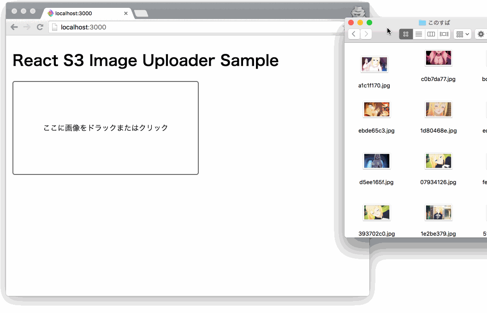

# react-s3-uploader-sample

[](https://greenkeeper.io/)

> react + aws s3 + axios + drag&drop

## Screenshots

# 

## Installation

```
$ git clone git@github.com:akameco/react-s3-uploader-sample.git
```

## Usage

## Development

```
$ npm install
$ npm run build
$ npm start
```

## License

MIT
